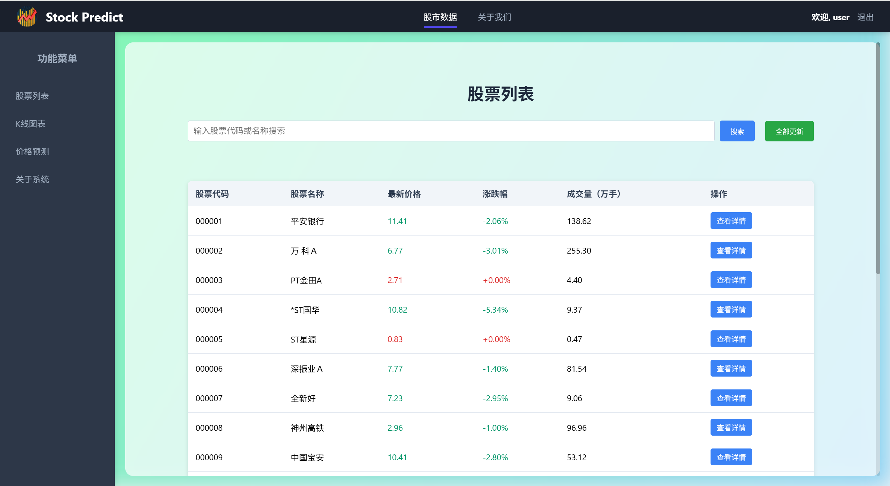
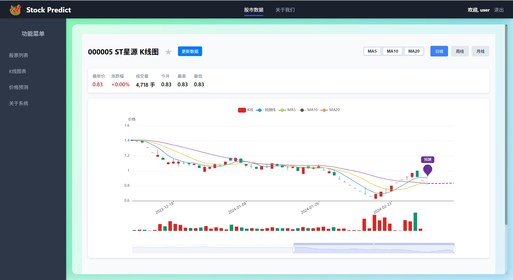
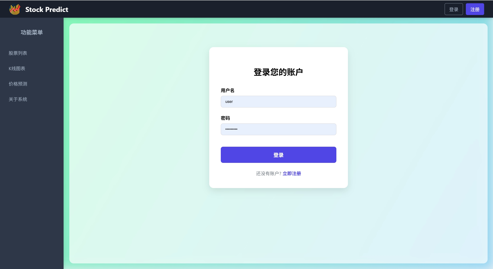

# 股票投资决策辅助系统 (ML-VUE Stock)

## 目录


*   [项目简介](#项目简介)

*   [核心功能](#核心功能)

*   [技术栈](#技术栈)

*   [项目结构](#项目结构)

*   [系统部署指南](#系统部署指南)


    *   [环境准备](#环境准备)
    
    *   [后端部署](#后端部署)
    
    *   [前端部署](#前端部署)

*   [使用说明](#使用说明)

*   [项目截图](#项目截图)

## 项目简介

股票投资决策辅助系统 是一个基于 Vue.js (前端) 和 Python Flask (后端) 构建的全栈 Web 应用。本项目旨在为股票投资者提供一个集数据可视化、个性化关注列表和 AI 智能预测于一体的辅助工具。

系统后端通过 akshare 库实时获取股票数据，并利用基于 TensorFlow (Keras) 构建的 LSTM（长短期记忆网络）模型对股票未来 5 天的收盘价进行预测。前端则使用 Element UI 和 ECharts 为用户提供了一个美观、直观且响应式的操作界面。

## 核心功能


*   **用户系统**：提供完整的用户注册和登录功能，保障用户数据的私密性。

*   **股票行情展示**：实时拉取并展示所有 A 股的基本行情数据，支持搜索和排序。

*   **K 线图可视化**：为单支股票提供专业的 K 线图表，直观展示历史价格走势。

*   **AI 价格预测**：本项目的核心功能，利用训练好的机器学习模型，对指定股票未来 5 个交易日的收盘价进行预测，并以图表形式呈现。

*   **自选股列表**：用户可以根据个人偏好，添加、查看和移除自己关注的股票，方便追踪。

*   **后台管理系统**：包含一个简单的申请 / 审批流程模块，可用于未来功能扩展（如策略申请、权限管理等）。

## 技术栈

本项目采用前后端分离的架构开发，具体技术栈如下：


| 技术领域 | 主要技术                                                        |
| ---- | ----------------------------------------------------------- |
| 前端   | Vue.js 2.x、Vue-Router、Vuex、Element UI、ECharts、Axios         |
| 后端   | Python 3.x、Flask、TensorFlow 2.x / Keras、Pandas、Scikit-learn |
| 数据源  | Akshare (用于获取实时股票数据)                                        |
| 数据库  | SQLite 3                                                    |

## 项目结构


```
.

├── backend/                # 后端代码目录

│   ├── api\_server.py       # Flask API 服务器主程序

│   ├── ml.py               # 机器学习模型加载与预测逻辑

│   ├── data\_updater.py     # 股票数据获取与数据库更新脚本

│   ├── models/             # 存放训练好的机器学习模型

│   │   └── stock\_model\_all.h5

│   └── stock\_data.db       # SQLite 数据库文件

│

└── frontend/               # 前端代码目录

&#x20;   ├── public/             # 静态资源

&#x20;   ├── src/                # 源代码

&#x20;   │   ├── assets/         # 资源文件（图片、样式等）

&#x20;   │   ├── components/     # 可复用组件 (本项目中部分组件放在views下)

&#x20;   │   ├── router/         # Vue-Router 路由配置

&#x20;   │   ├── store/          # Vuex 状态管理

&#x20;   │   └── views/          # 页面级组件

&#x20;   ├── package.json        # 项目依赖与脚本配置

&#x20;   └── vue.config.js       # Vue CLI 配置文件
```

## 系统部署指南

请遵循以下步骤在本地环境中部署并运行此项目。

### 环境准备


*   Python: 3.8 或更高版本

*   Node.js: 14.x 或更高版本

*   包管理工具: pip (Python) 和 npm 或 yarn (Node.js)

### 后端部署


1.  克隆代码库


```
git clone \<your-repository-url>

cd ml\_vue/20241203/backend
```


1.  创建虚拟环境并安装依赖


```
\# 创建虚拟环境 (推荐)

python -m venv venv

\# 激活虚拟环境

\# Windows

.\venv\Scripts\activate

\# macOS/Linux

source venv/bin/activate

\# 安装 Python 依赖

pip install flask flask-cors pandas tensorflow scikit-learn akshare tqdm
```


1.  初始化数据库和数据

    运行数据更新脚本，该脚本会自动创建数据库 stock\_data.db 并拉取最新的股票列表。


```
python data\_updater.py
```

此过程可能需要一些时间，取决于网络状况。


1.  启动后端服务


```
python api\_server.py
```

服务默认运行在 [http://127.0.0.1](http://127.0.0.1:5000)[:5000](http://127.0.0.1:5000)。

### 前端部署


1.  进入前端目录并安装依赖


```
\# 在新终端中操作

cd ../frontend

npm install
```


1.  启动前端开发服务器


```
npm run serve
```

项目将启动一个开发服务器，通常地址为 [http://localhost](http://localhost:8080)[:8080](http://localhost:8080)。


1.  访问应用

    在浏览器中打开前端开发服务器的地址 (如 [http://localhost](http://localhost:8080)[:8080](http://localhost:8080)) 即可开始使用。

## 使用说明


*   **注册 / 登录**：首次使用需要注册一个账户，然后登录系统。

*   **浏览股票**：在 "股票列表" 页面，可以查看所有股票的实时行情。

*   **查看详情与预测**：点击任意一支股票，将跳转到详情页。


    *   **K 线图**：默认显示该股票的历史 K 线数据。
    
    *   **AI 预测**：点击 "AI 预测" 按钮，系统将加载并显示未来 5 个交易日的收盘价预测曲线。

*   **管理自选股**：


    *   在详情页，可以点击 "加入自选" 将股票添加到个人关注列表。
    
    *   在 "我的自选" 页面，可以查看和管理所有已添加的自选股，也可以在此处将其移除。

## 项目截图







*   **登录页面**: 简洁的登录表单，包含用户名和密码输入框。

*   **股票列表页**: 使用表格展示股票代码、名称、最新价、涨跌幅等关键信息。

*   **股票详情页**:


    *   **K 线图区域**: 占据页面主要位置，包含成交量图，支持缩放和拖动。
    
    *   **AI 预测图**: 在 K 线图下方，用不同颜色的曲线展示历史收盘价和预测收盘价，清晰明了。

